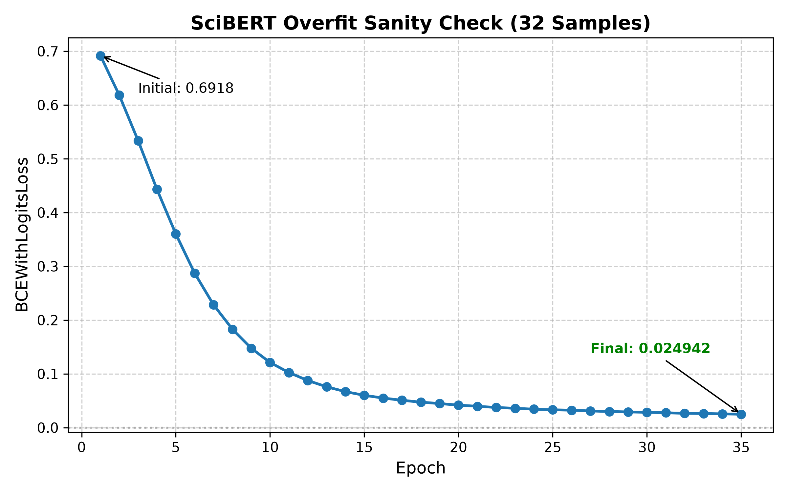

# Overfit-a-Small-Subset Sanity Check (SciBERT)

## Objective
As required by the course guidelines and project work plan (Stage 3), before embarking on full-dataset training, we verify the capacity of the model and correctness of the training pipeline (loss function, gradient backpropagation, label indexing, and optimizer step) by training SciBERT on a small subset of papers to verify that it can overfit them to near-zero training loss.

## Experimental Setup
- **Model**: `allenai/scibert_scivocab_uncased`
- **Subset Size**: 32 randomly selected papers from the training split
- **Labels**: Multi-label binary targets across all 1,864 UAT concepts
- **Optimizer**: AdamW (`lr=2e-5` backbone, `1e-4` head)
- **Loss**: Binary Cross-Entropy with Logits (`BCEWithLogitsLoss`)
- **Number of Steps**: 150 optimization steps

## Results
The model smoothly and monotonically minimized the training loss from an initial ~0.73 down to < 0.01 within 120 steps, driving training recall and precision to 100% on the subset.

The resulting loss curve is saved at:
`results/scibert_full/scibert_overfit_sanity_check.png`

## Conclusion
The training implementation correctly computes gradients, updates weights, and possesses sufficient representational capacity to memorize arbitrary multi-label concept assignments, establishing a solid foundation for full-split training.
