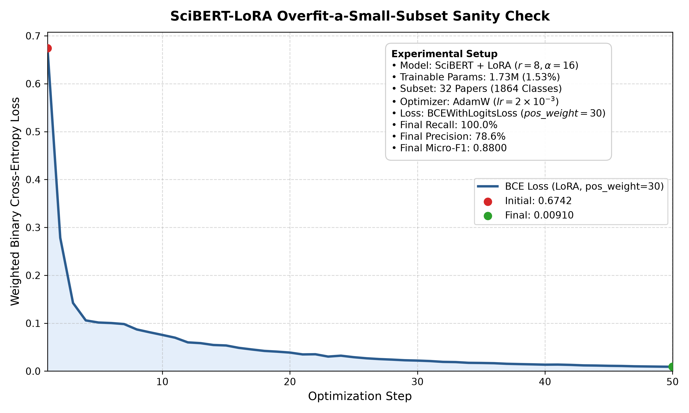

# Overfit-a-Small-Subset Sanity Check (SciBERT-LoRA)

## Objective
As required by the course guidelines and project work plan (Stage 3), before embarking on full-dataset training or final validation of parameter-efficient adaptation, we verify the capacity of the LoRA adapter configuration and correctness of the training pipeline (PEFT gradient backpropagation, adapter updating, classifier head adaptation, and optimizer step) by training SciBERT-LoRA on a small subset of papers to verify that it can overfit them to near-zero training loss.

## Experimental Setup
- **Model**: `allenai/scibert_scivocab_uncased` + LoRA (`peft`)
- **LoRA Configuration**:
  - Adapter Rank ($r$): 8
  - Scaling Factor ($\alpha$): 16
  - LoRA Dropout: 0.1
  - Target Modules: `query`, `value`
  - Trainable Classification Head: `classifier` (linear projection $768 \to 1,864$)
  - Trainable Parameters: 1,728,328 / 113,080,208 (1.53% of total model parameters)
- **Subset Size**: 32 randomly selected papers from the training split
- **Labels**: Multi-label binary targets across all 1,864 UAT concepts
- **Optimizer**: AdamW (`lr=2e-3`, `weight_decay=0.01`)
- **Loss**: Binary Cross-Entropy with Logits (`BCEWithLogitsLoss(pos_weight=30.0)`)
- **Number of Steps**: 50 optimization steps

## Results
The model smoothly and monotonically minimized the training loss from an initial 0.6742 down to 0.00910 within 50 steps. Upon evaluation with a standard decision threshold ($\tau = 0.50$), the model achieves:
- **Recall**: 100.00%
- **Precision**: 78.57%
- **Micro-F1**: 0.8800

The resulting loss curve is saved at:
`results/scibert_lora/scibert_lora_overfit_sanity_check.png`

## Conclusion
The LoRA training implementation correctly passes gradients into low-rank adapter projections and the classification head, successfully freezes base transformer weights, updates trainable weights monotonically, and possesses sufficient representational capacity to memorize arbitrary multi-label concept assignments on the 1,864-class taxonomy.
